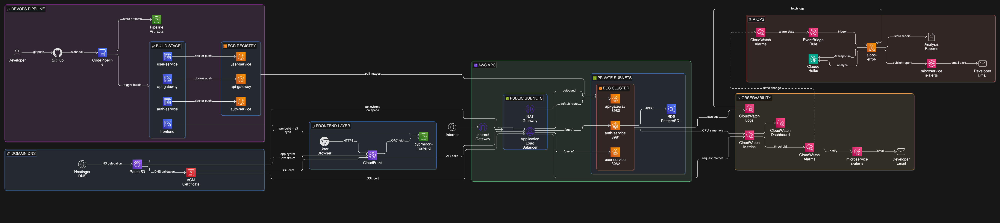

<div align="center">

# Cloud-Native Microservices Platform — AWS ECS Fargate + AIOps

**A production-grade, cloud-native authentication and identity platform built on AWS, demonstrating real-world microservices architecture, automated CI/CD, full observability, and AI-powered incident response.**

[](https://aws.amazon.com/fargate/)
[](https://spring.io/projects/spring-boot)
[](https://react.dev/)
[](https://www.terraform.io/)
[](LICENSE)

🟢 **Status:** Live in Production
☁️ **Cloud:** AWS (`eu-north-1` Stockholm)
🔐 **Domain:** `api.cybrmoon.space` (backend) · `app.cybrmoon.space` (frontend)
🤖 **AIOps:** Amazon Bedrock (Claude Haiku)

</div>

---

## Project Overview

This platform is a JWT-based identity and access management system designed for distributed microservices. It provides user registration, authentication, and token-based authorization across independently deployed services running on AWS ECS Fargate. The frontend is a React single-page application served via CloudFront, and the backend API is exposed through an Application Load Balancer with path-based routing, HTTPS enforcement, and custom domain integration.

The project was built to demonstrate production-level AWS cloud engineering, DevOps automation, and system design at scale. Every component — from the VPC networking to the AI-powered incident response — follows real-world practices used in enterprise environments. It is not a tutorial application or a prototype; it is a fully deployed, monitored, and operationally mature platform running in production.

What makes this platform production-grade is the depth of its infrastructure. All compute and database resources run in private subnets with no public IP addresses. The RDS PostgreSQL instance is accessible only from the ECS security group. Flyway manages all schema migrations, and `ddl-auto` is set to `validate` to prevent accidental schema drift. Authentication is stateless via JWT, enabling horizontal scaling without session affinity. The CI/CD pipeline deploys all three microservices in parallel with rolling updates and zero downtime. When any CloudWatch alarm fires, an AI-powered Lambda function fetches relevant logs, sends them to Amazon Bedrock for analysis, and emails a structured incident report to the engineering team.

The technology philosophy behind this project was deliberate: every AWS resource was first created manually through the console to build deep understanding of how each service works, how they interconnect, and where the failure modes are. After the infrastructure was proven in production, it was codified in Terraform for reproducibility, auditability, and disaster recovery.

---

## Architecture



### System Design

Traffic enters the system through two paths. For the frontend, users navigate to `app.cybrmoon.space`, which resolves via Route 53 to a CloudFront distribution backed by a private S3 bucket. CloudFront serves the static React application with Origin Access Control (OAC) ensuring the S3 bucket is never publicly accessible.

For API calls, the browser sends requests to `api.cybrmoon.space`, which resolves via Route 53 to the internet-facing Application Load Balancer. The ALB terminates TLS using an ACM wildcard certificate and performs path-based routing: requests matching `/auth/**` are forwarded to the Auth Service target group, `/users/**` to the User Service target group, and all other traffic to the API Gateway target group. All three ECS Fargate services run in private subnets within the VPC, reachable only through the ALB.

The Auth Service handles user registration and login. It hashes passwords with BCrypt, stores user records in an RDS PostgreSQL 15 instance (also in a private subnet), and generates signed JWT tokens using HMAC-SHA256. The User Service is a stateless microservice that validates JWT tokens on every request — it has no database and serves protected endpoints like `/users/profile`. The API Gateway, built on Spring Cloud Gateway's reactive stack, routes traffic between services and manages CORS configuration for both `localhost:3000` (development) and `app.cybrmoon.space` (production).

### Infrastructure Overview

| Layer | Service | Details |
|---|---|---|
| DNS | Route 53 | `api.cybrmoon.space` + `app.cybrmoon.space` |
| SSL/TLS | ACM | Wildcard certificate `*.cybrmoon.space` |
| CDN | CloudFront | React frontend, OAC-protected S3 origin |
| Static Hosting | S3 | `cybrmoon-frontend` bucket |
| Load Balancing | ALB | Path-based routing, HTTP→HTTPS redirect |
| Compute | ECS Fargate | 3 services, private subnets, no EC2 managed |
| Database | RDS PostgreSQL 15 | `db.t3.micro`, private subnet, no public access |
| Container Registry | ECR | 3 private repositories |
| Networking | VPC | `10.0.0.0/16`, 2 public + 2 private subnets, IGW + NAT |
| CI/CD | CodePipeline + CodeBuild | GitHub → build → ECR → ECS rolling deploy |
| Observability | CloudWatch | Logs, metrics, 7 alarms, dashboard |
| Alerting | SNS | Email notifications on all alarms |
| AIOps | Lambda + Bedrock | AI incident analysis on alarm trigger |
| IaC | Terraform | Full infrastructure as code |

---

## Microservices

### Auth Service (port 8081)

The Auth Service is the identity provider for the platform. Built with Spring Boot 3 on Java 17, it handles user registration and login, issuing signed JWT tokens for authenticated sessions.

- Passwords are hashed with BCrypt via Spring Security's `PasswordEncoder`
- JWT tokens are generated using HMAC-SHA256 with the `jjwt 0.12.5` library
- User records are persisted in PostgreSQL via Spring Data JPA
- Schema migrations are managed by Flyway (`V1__create_users_table.sql`)
- `ddl-auto` is set to `validate` — Flyway owns the schema, Hibernate only validates it
- Bean validation enforces `@Email` and `@NotBlank` on `RegisterRequest`
- `@JsonProperty(access = WRITE_ONLY)` prevents password leakage in API responses
- `GlobalExceptionHandler` maps exceptions to proper HTTP status codes:
  - `UserAlreadyExistsException` → `409 Conflict`
  - `UserNotFoundException` → `404 Not Found`
  - `InvalidCredentialsException` → `401 Unauthorized`
  - `MethodArgumentNotValidException` → `400 Bad Request`

| Method | Endpoint | Description |
|---|---|---|
| `POST` | `/auth/register` | Register a new user (201 Created) |
| `POST` | `/auth/login` | Authenticate and receive JWT (200 OK) |
| `GET` | `/auth/health` | Health check for ALB target group |

### User Service (port 8082)

The User Service is a stateless, protected microservice. It has no database — its sole responsibility is JWT validation and serving authorized requests.

- Built with Spring Boot 3, Java 17
- `JwtFilter` extends `OncePerRequestFilter` to validate the `Authorization: Bearer` header on every request
- The JWT secret is injected via environment variable and is identical across all services
- No `jwt.expiration` configuration — this service only validates, never generates tokens

| Method | Endpoint | Description |
|---|---|---|
| `GET` | `/users/profile` | Returns user profile (requires Bearer JWT) |
| `GET` | `/users/health` | Health check for ALB target group |

### API Gateway (port 8080)

The API Gateway is built on Spring Cloud Gateway's reactive, non-blocking stack. It serves as the single entry point for all API traffic in local development.

- Path-based routing: `/auth/**` → Auth Service, `/users/**` → User Service
- CORS is configured at the gateway level with dual-origin support (`localhost:3000` and `app.cybrmoon.space`) using separate environment variables per origin
- `DedupeResponseHeader` filter prevents duplicate `Access-Control-Allow-Origin` headers when both the gateway and upstream service set CORS headers simultaneously
- Spring Boot Actuator exposes `/actuator/health` for ALB health checks
- Routing URIs are externalized: `AUTH_SERVICE_URI` and `USER_SERVICE_URI` environment variables allow the same image to run locally (pointing to Docker hostnames) and on AWS (pointing to the ALB DNS)

---

## CI/CD Pipeline

The deployment pipeline is fully automated. A `git push` to the `main` branch on GitHub (`h8815/aws-fargate`) triggers the entire flow, and updated services are live in production within 5–8 minutes.

**Stage 1 — Source:** GitHub (OAuth connection) detects the push and stores the source artifact in S3 (`microservices-pipeline-artifacts-314772756285`).

**Stage 2 — Build:** Three CodeBuild projects run in parallel (`auth-service-build`, `user-service-build`, `api-gateway-build`). Each project runs a Docker multi-stage build, tags the image with the git commit SHA for traceability, pushes the image to the corresponding ECR repository, and outputs an `imagedefinition.json` artifact.

**Stage 3 — Deploy:** Three ECS deploy actions run in parallel, each consuming its respective `imagedefinition.json` to trigger a rolling update on the ECS service. Fargate drains existing tasks and launches new ones with zero downtime.

**Frontend:** A separate CodeBuild project runs `npm ci` and `npm run build` with `VITE_API_URL=https://api.cybrmoon.space` injected at build time. The compiled `dist/` output is synced to the S3 frontend bucket, and a CloudFront cache invalidation is triggered.

```yaml
# buildspec.yml pattern (backend services)
version: 0.2
phases:
  pre_build:
    commands:
      - echo Logging in to Amazon ECR...
      - aws ecr get-login-password --region $AWS_DEFAULT_REGION | docker login --username AWS --password-stdin $ECR_REPO_URI
      - IMAGE_TAG=$(echo $CODEBUILD_RESOLVED_SOURCE_VERSION | cut -c 1-7)
  build:
    commands:
      - echo Building Docker image...
      - docker build -t $ECR_REPO_URI:$IMAGE_TAG .
  post_build:
    commands:
      - echo Pushing Docker image...
      - docker push $ECR_REPO_URI:$IMAGE_TAG
      - printf '[{"name":"%s","imageUri":"%s"}]' $CONTAINER_NAME $ECR_REPO_URI:$IMAGE_TAG > imagedefinitions.json
artifacts:
  files:
    - imagedefinitions.json
```

---

## Security Architecture

- **Network isolation:** All ECS tasks and the RDS instance run in private subnets. No backend resource has a public IP address. Outbound internet access for private subnets is provided exclusively through a NAT Gateway in the public subnet.
- **Security group chain:** Traffic flows through a strict chain — `alb-sg` accepts inbound `80` and `443` from `0.0.0.0/0`; `ecs-sg` accepts `8080`, `8081`, `8082` from `alb-sg` only; `rds-sg` accepts `5432` from `ecs-sg` only.
- **No SSH, no key pairs:** There are no EC2 instances, no SSH keys, and no bastion hosts. All compute runs on Fargate, which provides isolation at the hypervisor level.
- **Secrets management:** Sensitive values (JWT secret, database credentials) are injected via ECS task definition environment variables. The architecture is ready for migration to AWS Secrets Manager.
- **JWT secret:** Minimum 256-bit cryptographically random key, generated with `openssl rand -base64 32`.
- **Password hashing:** All passwords are hashed with BCrypt before storage. Plaintext passwords never touch the database.
- **Defense in depth:** `/internal/**` endpoints require a valid JWT even within the private network.
- **HTTPS everywhere:** The ALB listener on port 80 issues a `301` redirect to HTTPS on port 443. All API traffic is encrypted in transit.
- **ACM certificate:** Wildcard certificate for `*.cybrmoon.space`, DNS-validated via Route 53, auto-renewing.
- **Frontend isolation:** The S3 bucket hosting the React application is private. It is accessible only through CloudFront via Origin Access Control (OAC).
- **Schema safety:** `ddl-auto: validate` in production prevents Hibernate from making any schema changes. Flyway owns all DDL.

---

## Observability

### CloudWatch Dashboard

The `microservices-dashboard` provides a single-pane view of platform health with the following widgets:

| Widget | Metric Source | Description |
|---|---|---|
| Request Count | ALB | Total incoming requests |
| 5XX Errors | ALB | `HTTPCode_ELB_5XX_Count` |
| CPU Utilization | ECS | All 3 services |
| Memory Utilization | ECS | All 3 services |
| Unhealthy Hosts | Target Groups | All 3 target groups (current: 0) |
| Alarm Status | CloudWatch | Aggregated alarm state |

### Alarms (7 total — all GREEN)

| Alarm | Metric | Threshold |
|---|---|---|
| `alb-5xx-errors-high` | `HTTPCode_ELB_5XX_Count` | > 10 |
| `auth-service-cpu-high` | `CPUUtilization` | > 80% |
| `user-service-cpu-high` | `CPUUtilization` | > 80% |
| `api-gateway-cpu-high` | `CPUUtilization` | > 80% |
| `auth-service-unhealthy-hosts` | `UnHealthyHostCount` | >= 1 |
| `user-service-unhealthy-hosts` | `UnHealthyHostCount` | >= 1 |
| `api-gateway-unhealthy-hosts` | `UnHealthyHostCount` | >= 1 |

All alarms publish to the `microservices-alerts` SNS topic, which delivers notifications via email.

### Log Groups

| Log Group | Retention |
|---|---|
| `/ecs/auth-service` | 7 days |
| `/ecs/user-service` | 7 days |
| `/ecs/api-gateway` | 7 days |

---

## AIOps — AI-Powered Incident Response

When a CloudWatch alarm transitions to the `ALARM` state, the AIOps pipeline activates automatically:

1. The alarm state change event is captured by an **EventBridge rule** (`aiops-alarm-trigger`)
2. The rule triggers the **Lambda function** (`aiops-error-analyzer`) — Python 3.12, 256 MB memory, 60-second timeout
3. The Lambda function identifies the relevant CloudWatch Log Group based on the alarm name
4. It fetches the last 10 minutes of logs (up to 50 log events) from that log group
5. The alarm metadata and log data are sent to **Amazon Bedrock** (`anthropic.claude-haiku-4-5`) in `eu-north-1`
6. Claude returns a structured analysis containing: **Summary**, **Root Cause**, **Immediate Action**, **Full Fix**, and **Prevention**
7. The Lambda function formats the analysis into a readable incident report and publishes it to the **SNS topic** (`microservices-alerts`)
8. The engineering team receives the complete AI-generated incident report via email

```
CloudWatch Alarm → EventBridge Rule → Lambda → Bedrock (Claude Haiku) → SNS → Email
```

**IAM Role** (`AIOpsLambdaRole`) permissions:
- `AWSLambdaBasicExecutionRole` — CloudWatch Logs write access for the Lambda itself
- `CloudWatchLogsReadOnlyAccess` — Read access to fetch ECS service logs
- `AmazonSNSFullAccess` — Publish incident reports to SNS
- `AmazonBedrockFullAccess` — Invoke Claude Haiku for analysis

---

## Infrastructure as Code

All AWS infrastructure is codified in Terraform under `infrastructure/terraform/`. The configuration uses a modular structure where each AWS resource group is isolated into its own module for clarity, reusability, and independent testing.

Remote state is stored in S3 (`cybrmoon-terraform-state-314772756285`) with DynamoDB-based state locking (`terraform-state-lock`) and encryption enabled. Default tags (`Project`, `Environment`, `ManagedBy`) are applied to every resource via the provider's `default_tags` block.

```
infrastructure/terraform/
├── main.tf                  # Provider config + S3 backend
├── variables.tf             # Input variables
├── outputs.tf               # Output definitions
├── terraform.tfvars         # Variable values
└── modules/
    ├── vpc/                 # VPC, subnets, IGW, NAT, route tables
    ├── security-groups/     # alb-sg, ecs-sg, rds-sg
    ├── rds/                 # PostgreSQL instance + subnet group
    ├── ecr/                 # 3 private repositories
    ├── ecs/                 # Cluster, task definitions, services
    ├── alb/                 # ALB, target groups, listener rules
    ├── route53/             # Hosted zone, A records
    ├── cloudwatch/          # Dashboard, log groups, alarms
    ├── sns/                 # Alert topic + subscriptions
    └── aiops/               # Lambda, EventBridge, IAM role
```

---

## Local Development

### Prerequisites

- Docker Desktop
- Java 17
- Maven 3.9+
- Node.js 20+

### Setup

```bash
# Clone the repository
git clone https://github.com/h8815/aws-fargate.git
cd aws-fargate

# Create environment file
cp .env.example .env
# Edit .env with local values (defaults work out of the box)

# Start all backend services
docker compose up --build -d

# Start the frontend dev server
cd frontend
npm install
npm run dev
```

### Local Services

| Service | URL |
|---|---|
| API Gateway | `http://localhost:8080` |
| Auth Service | `http://localhost:8081` |
| User Service | `http://localhost:8082` |
| Frontend | `http://localhost:3000` |
| PostgreSQL | `localhost:5432` |

### Integration Tests

Run the full test suite with PowerShell:

```powershell
.\test-gateway.ps1
```

| Test | Endpoint | Expected |
|---|---|---|
| Register | `POST /auth/register` | `201 Created` |
| Login | `POST /auth/login` | `200 OK` + JWT token |
| Profile (no token) | `GET /users/profile` | `401 Unauthorized` |
| Profile (with JWT) | `GET /users/profile` | `200 OK` + email |
| Wrong password | `POST /auth/login` | `401 Unauthorized` |
| Duplicate email | `POST /auth/register` | `409 Conflict` |

---

## Tech Stack

| Category | Technology | Version / Details |
|---|---|---|
| Runtime | Java | 17 (Eclipse Temurin) |
| Framework | Spring Boot | 3.2.x |
| Gateway | Spring Cloud Gateway | Reactive (WebFlux) |
| Security | Spring Security + jjwt | BCrypt + HMAC-SHA256, jjwt 0.12.5 |
| Database | PostgreSQL | 15 (RDS `db.t3.micro`) |
| Migrations | Flyway | Schema-first, `ddl-auto: validate` |
| Containerization | Docker | Multi-stage builds, Alpine JRE |
| Container Registry | Amazon ECR | 3 private repositories |
| Orchestration | Amazon ECS Fargate | Serverless, `awsvpc` network mode |
| Load Balancing | Application Load Balancer | Path-based routing, TLS termination |
| CDN | Amazon CloudFront | OAC-protected S3 origin |
| DNS | Amazon Route 53 | Public hosted zone |
| SSL/TLS | AWS Certificate Manager | Wildcard `*.cybrmoon.space`, auto-renew |
| CI/CD | AWS CodePipeline + CodeBuild | Parallel build + deploy, rolling updates |
| Observability | Amazon CloudWatch | Logs, metrics, dashboard, 7 alarms |
| AIOps | AWS Lambda + Amazon Bedrock | Claude Haiku, Python 3.12 |
| IaC | Terraform | S3 backend, DynamoDB locking |
| Frontend | React 18 + Vite + Tailwind CSS | TypeScript, dark theme, WebGL shaders |
| Build Tool | Maven | 3.9.6 |

---

## Repository Structure

```
aws-fargate/
├── auth-service/
│   ├── src/main/java/com/authservice/
│   │   ├── config/              # SecurityConfig, PasswordConfig, CorsConfig
│   │   ├── controller/          # AuthController, UserController
│   │   ├── dto/                 # LoginRequest, LoginResponse, RegisterRequest
│   │   ├── entity/              # User
│   │   ├── exception/           # GlobalExceptionHandler + custom exceptions
│   │   ├── repository/          # UserRepository
│   │   ├── security/            # JwtFilter, JwtUtil
│   │   └── service/             # UserService
│   ├── src/main/resources/
│   │   ├── application.yml
│   │   └── db/migration/V1__create_users_table.sql
│   ├── Dockerfile
│   ├── buildspec.yml
│   └── pom.xml
├── user-service/
│   ├── src/main/java/com/userservice/
│   │   ├── config/              # SecurityConfig, CorsConfig
│   │   ├── controller/          # UserController
│   │   ├── security/            # JwtFilter, JwtUtil
│   │   └── UserServiceApplication.java
│   ├── Dockerfile
│   ├── buildspec.yml
│   └── pom.xml
├── api-gateway/
│   ├── src/main/java/com/apigateway/
│   │   └── ApiGatewayApplication.java
│   ├── src/main/resources/application.yml
│   ├── Dockerfile
│   ├── buildspec.yml
│   └── pom.xml
├── frontend/
│   ├── src/
│   │   ├── pages/               # Login, Register, Dashboard
│   │   ├── components/          # Navbar, ProtectedRoute, UI components
│   │   ├── context/             # AuthContext (JWT state management)
│   │   └── api/                 # Axios instance with JWT interceptor
│   ├── buildspec.yml
│   └── package.json
├── infrastructure/
│   └── terraform/
│       ├── main.tf
│       ├── variables.tf
│       ├── outputs.tf
│       ├── terraform.tfvars
│       └── modules/
│           ├── vpc/
│           ├── security-groups/
│           ├── rds/
│           ├── ecr/
│           ├── ecs/
│           ├── alb/
│           ├── route53/
│           ├── cloudwatch/
│           ├── sns/
│           └── aiops/
├── docker-compose.yml
├── .env.example
├── test-gateway.ps1
├── assets/
│   └── aws.png
└── README.md
```

---

<div align="center">

**[Live API](https://api.cybrmoon.space/auth/health)** · **[Frontend](https://app.cybrmoon.space)** · **[GitHub](https://github.com/h8815/aws-fargate)**

Built by **Himanshu** — Indore, India

</div>
